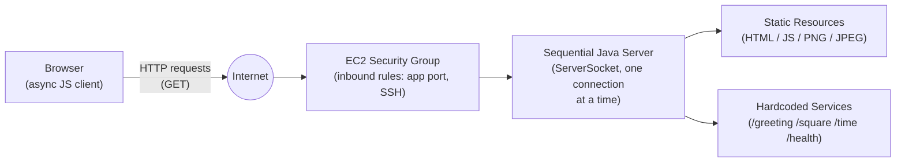

# Networking: From a Minimal HTTP Server to a Web Application on AWS

## Digital Transformation in Enterprise Systems (TDSE) - Lab 5

## Nicolás Toro Criollo

---

## Project title and description

This project extends a minimal, socket-based Java HTTP server (built directly on top of `java.net.ServerSocket`, with no external web framework) into a small sequential web application. The application serves static resources (HTML, JavaScript, and images), exposes a handful of hardcoded dynamic services that respond with JSON, and is deployed to a single AWS EC2 instance.

The problem this lab addresses is understanding *what a web server actually does* before hiding that behavior behind a framework: how an HTTP request is structured on the wire, how a browser turns a single page load into several separate requests, how content types drive browser behavior, and — critically — what it means for a server to be **sequential** rather than concurrent. The scope is intentionally limited: one client at a time, no threads, no thread pools, no database, no authentication, and no production-grade security. This is a baseline for understanding scalability, not a scalable system.

## System metaphor and architecture

**System metaphor: a single-window service counter.**

Think of the server as a small office with exactly one service window and one clerk. Visitors (browser requests) line up outside. The clerk (the server's single thread of execution) helps exactly one visitor at a time: reads their request, decides whether they're asking for a document from the filing cabinet (a static resource) or a quick calculation (a hardcoded service), prepares the answer, and only then calls the next person in line. If a visitor's request takes a long time, everyone behind them simply waits — the clerk cannot split themselves in two. Moving the office from a room in my house (localhost) to a rented office downtown (EC2) changes the location and who can walk in the door, but it doesn't hire a second clerk. That's precisely the boundary this lab explores, and precisely why it doesn't get resolved here — concurrency is a separate architectural step.

**Component responsibilities:**

- **Browser (asynchronous JavaScript client):** the visitor-facing side of the system. It renders `index.html`, and its embedded `app.js` uses `fetch()` to call the hardcoded services without ever triggering a full page reload. It is responsible for keeping the *interface* responsive, not the server.
- **HTTP requests over TCP:** the protocol exchange between browser and server — a request line, headers, a blank line, and (for POST-like semantics, though this lab only accepts GET) a body.
- **Hardcoded services:** four explicit, directly-coded conditions (`/greeting`, `/square`, `/time`, `/health`) that recognize specific paths and produce JSON. There is no routing framework, no reflection, and no annotations — the path-to-behavior mapping is visible directly in the code.
- **Static resources:** HTML, JavaScript, and image files stored under `src/main/resources/public/`, served as raw bytes with a content type resolved from the file extension.
- **Sequential Java server:** the clerk from the metaphor. A single `ServerSocket` accepts one `Socket` connection at a time, fully services it (reads the request, writes the response, closes the client socket), and only then accepts the next one. No threads are created.
- **AWS EC2 instance / Security Group:** the "office building." The security group acts as the building's front door, only allowing traffic on the ports the application actually needs (the app port, and — while in use — SSH). The server process itself is unaware it moved; the only things that changed are the network boundary and where the process happens to run.

**Architecture diagram:**



## Design decisions

- **Why the server remains sequential:** the lab's explicit purpose is to observe the limitations of a single-threaded server before introducing concurrency. Adding threads at this stage would hide exactly the behavior (requests queueing behind each other) that the lab is designed to make visible. Concurrency is deliberately left for a later architectural step.
- **Why the routes are intentionally hardcoded:** a routing framework, reflection-based dispatcher, or annotation system would abstract away the mechanism by which a URL path selects behavior. Writing four explicit `if` conditions keeps that mechanism visible and inspectable.
- **How content types are selected:** the server maps file extensions (`.html`, `.js`, `.png`, `.jpg`/`.jpeg`) to their corresponding MIME types through a small static lookup table. Every resource — text or binary — is read as raw bytes and sent with a `Content-Length` calculated from the actual byte array, not from a character count, so binary files (images) and text files follow the exact same response path without special-casing.
- **How unsafe paths are rejected:** the requested path is resolved against the public resources root and then canonicalized with `Path.toRealPath()`, which resolves any `..` segments to their real, absolute location on disk. The resulting real path is only served if it still starts with the public root; anything that resolves outside of it (a path traversal attempt) is treated as not found, and the file's contents are never disclosed.
- **Why the browser client is asynchronous:** the requirement is that a single service call (asking for a greeting, a square, or the server time) must not reload the entire page. `fetch()` combined with `event.preventDefault()` on each form's submit event keeps the browser responsive and updates only the relevant part of the DOM, while the server underneath continues to process each request sequentially — asynchronous on the client does not imply concurrent on the server, and this project deliberately demonstrates that gap rather than closing it.

## Project structure

```
.
├── pom.xml
├── src/
│   ├── main/
│   │   ├── java/edu/eci/tdse/
│   │   │   ├── MinimalHttpServer.java     # entry point, connection loop, request handling
│   │   │   ├── ResourceResolver.java      # static file resolution + path traversal protection
│   │   │   ├── ContentTypeResolver.java   # extension → MIME type mapping
│   │   │   ├── QueryStringParser.java     # query string parsing + URL decoding
│   │   │   ├── HardcodedServices.java     # the four special service URLs
│   │   │   └── JsonUtil.java              # manual JSON string escaping
│   │   └── resources/public/              # static resources served by the app
│   │       ├── index.html
│   │       ├── app.js
│   │       └── images/
│   └── test/java/edu/eci/tdse/            # test sources (kept separate from main sources)
└── docs/evidence/images/                  # screenshots supporting the lab deliverables
```

## Prerequisites

- Java 17 (OpenJDK / Amazon Corretto 17 on the EC2 side)
- Maven 3.9+
- A modern browser with developer tools (for inspecting network requests)
- (Optional, for local packaging tests) enough disk space to build and run the packaged jar outside the project folder

## Installation and build

```bash
git clone https://github.com/NicoToro25/TDSE-Lab5-From-Minimal-HTTP-Server-to-Web-Application.git
cd TDSE-Lab5-From-Minimal-HTTP-Server-to-Web-Application

# Run the test suite
mvn test

# Produce the deployable artifact
mvn clean package
```

The build produces `target/lab5-networking.jar`.

## How to run locally

```bash
# Default port (35000)
mvn compile exec:java "-Dexec.mainClass=edu.eci.tdse.MinimalHttpServer"

# Or, using the packaged jar with a custom port
java -jar target/lab5-networking.jar 8080
```

The port can be set either as the first command-line argument or via the `SERVER_PORT` environment variable; if neither is provided, it defaults to `35000`.

Open a browser at `http://localhost:<port>/` to reach the application. To stop the server, press `Ctrl+C` in the terminal where it is running (or, on EC2 with the managed service configured, `sudo systemctl stop lab5-networking.service`).

## How to use the application

The home page exposes three actions, each backed by a form that submits asynchronously (no page reload):

- **Greeting service** — enter a name and submit; the result area displays a JSON-derived greeting message. Submitting with an empty name returns a controlled `400 Bad Request`, shown in the page's error area.
- **Square service** — enter a number and submit; the result area displays the input and its square. A non-numeric value returns a controlled `400 Bad Request`.
- **Server time** — submitting this form (no input required) returns the server's current time, demonstrating that the value originates from the server rather than the browser's own clock.

A loading indicator is shown while a request is in flight, and a dedicated error area displays either a validation error returned by the server or a network-failure message if the server cannot be reached at all — these are treated as two distinct failure modes.

Directly reachable service URLs (all GET-only):

| URL | Required input | Example |
|---|---|---|
| `/greeting` | `name` query parameter | `/greeting?name=Nicolas` |
| `/square` | `value` query parameter (numeric) | `/square?value=5` |
| `/time` | none | `/time` |
| `/health` | none | `/health` |

## How to run the tests

Automated tests are run with:

```bash
mvn test
```

In addition to automated tests, this lab relies heavily on manual functional verification, since the exercise is specifically about observing raw protocol and concurrency behavior rather than only asserting on outputs. The manual procedure I followed was:

1. Load the home page and confirm, via browser developer tools, that the HTML, JavaScript, and images each arrive as separate, successful requests with the correct content types.
2. Exercise each hardcoded service once with valid input and once with invalid input, checking both the HTTP status code and the response body (`curl -i`).
3. Request a non-existent static file and confirm a `404`; request a service with an unsupported HTTP method and confirm a `405`.
4. Attempt a path traversal request (`/../pom.xml`) and confirm it is rejected with no file contents disclosed.
5. Run ten consecutive requests against the running server and confirm none of them require a restart.
6. Open the application in two browser windows, trigger an artificially slow request in the first, and confirm — via the Network tab's timing — that the second window's request stays pending until the first one completes.

## AWS deployment

The application is deployed to a single Amazon Linux 2023 EC2 instance. Rather than transferring build artifacts manually, I clone the public GitHub repository directly onto the instance and build it there with Maven, which avoids any manual file-transfer step:

```bash
sudo dnf install -y java-17-amazon-corretto git maven
git clone https://github.com/NicoToro25/TDSE-Lab5-From-Minimal-HTTP-Server-to-Web-Application.git
cd lab5-networking
mvn clean package
java -jar target/lab5-networking.jar 8080
```

I connect to the instance using **EC2 Instance Connect** (the browser-based connection method) rather than SSH from my own machine, because port 22 is blocked outbound on the network I normally work from; EC2 Instance Connect uses HTTPS under the hood and was unaffected by that restriction. The lab guide accepts this as one of the approved connection methods.

To keep the application running after the administrative session ends, it is configured as a `systemd` service (`/etc/systemd/system/lab5-networking.service`) with `Restart=on-failure`, `WorkingDirectory` set to the cloned repository so the relative path to `src/main/resources/public` still resolves correctly, and stdout/stderr redirected to a log file. It is enabled and started with:

```bash
sudo systemctl daemon-reload
sudo systemctl enable lab5-networking.service
sudo systemctl start lab5-networking.service
```

I verified the service from inside the instance with `sudo systemctl status lab5-networking.service` (reporting `active (running)`), and from my own computer by closing every AWS console/Instance Connect tab and confirming the application was still reachable at the instance's public address and port afterward.

The instance's security group allows inbound traffic only on the application port and, while needed, SSH; the SSH rule was removed once I confirmed EC2 Instance Connect was sufficient for this lab.

## Evidence and results

Screenshots supporting each stage of the lab (local execution, the static-resource network waterfall, the asynchronous request/response cycle, controlled error responses, the sequential-limitation experiment with two browser windows, and the remote EC2 execution) are stored under `docs/evidence/images/`.

## Known limitations

- The server is **sequential**: it processes exactly one connection at a time and does not use threads, thread pools, or any concurrency mechanism. A second client's request always waits for the first to finish, regardless of how quickly it arrives.
- Only the `GET` HTTP method is supported; any other method returns `405 Method Not Allowed`.
- Only four hardcoded service paths exist; there is no general-purpose routing.
- There is no authentication, no HTTPS/TLS, no database, and no production-grade hardening — this is a teaching baseline, not a production HTTP server.
- The deployment targets exactly one EC2 instance; there is no load balancing, autoscaling, or redundancy.

## Reflection

**1. Why does a single HTML page cause several HTTP requests?**
Because the HTML document itself only describes *references* to other resources — a `<script>` tag pointing at `app.js`, an `` tag pointing at an image file. The browser has to parse the HTML first before it even knows those other resources exist, so it necessarily issues a separate HTTP request for each one once it discovers them. What looks like "loading one page" is really the browser discovering and fetching a small tree of dependent resources, one request per resource.

**2. Why must image responses be treated as bytes rather than text?**
Because image formats like PNG and JPEG are binary — they are not valid sequences of characters in any text encoding, and passing them through a text-oriented API (like a `PrintWriter`, which assumes a character encoding) would corrupt the data by trying to interpret raw byte values as characters. Reading and writing everything as a byte array sidesteps that problem entirely and, as a side benefit, makes text and binary resources go through the exact same code path.

**3. What is the role of the response content type?**
The `Content-Type` header tells the browser how to interpret the bytes it just received. Without it (or with an incorrect one), the browser has no reliable way to know whether a response is HTML to render, JavaScript to execute, or an image to decode and paint — the bytes alone are ambiguous.

**4. What is hardcoded in this design, and what would a routing framework eventually generalize?**
What's hardcoded is the mapping from a specific URL path to a specific piece of server behavior — four explicit `if` conditions checking the path string directly. A routing framework would generalize this into a declarative table or annotation-based mapping (e.g., "any path matching this pattern, dispatch to that method"), along with parameter binding, content negotiation, and so on — all of which is convenient, but also hides the very mechanism this lab wants visible.

**5. Why can the browser remain responsive while the server still handles requests sequentially?**
Because the browser's responsiveness and the server's concurrency are two independent things. `fetch()` is asynchronous on the client: it lets the browser keep rendering and responding to user input while it waits for a response, instead of freezing the UI. But that says nothing about what happens on the other end of the connection — my server still finishes one request completely before starting the next. I confirmed this directly by opening two browser windows and seeing the second one's request sit "pending" until the first, artificially slow one, finished.

**6. What changed when the server moved to EC2? What did not change?**
What changed was the network boundary and the physical (virtual) machine the process runs on: instead of `localhost`, the application is reachable at a public IP, behind a security group that controls who can even attempt to connect. What did not change was the application itself — the same jar, the same sequential accept-loop, the same hardcoded services and static resource handling. Moving to the cloud changed *where* the bottleneck lives, not *whether* there is one.

**7. What happens when two users send slow requests at almost the same time?**
The second user's request is accepted at the TCP level (the operating system queues the connection), but my server does not start working on it until it finishes handling the first one. I predicted this before running the experiment, and the result matched exactly: the second window stayed in a "pending" state for the full duration of the first request's artificial delay, even though both requests were fired only moments apart.

**8. What is the next architectural limitation you would address — and why should concurrency come before load balancing?**
The next limitation to address is the complete lack of concurrency within a single server process. Introducing load balancing before that would just mean distributing traffic across multiple copies of a server that is still, individually, capable of doing only one thing at a time — it would hide the bottleneck by spreading it across more machines rather than actually resolving it. Concurrency (for example, handling each connection on its own thread, or with a thread pool) lets a single instance make better use of the resources it already has; only once that's in place does adding more instances behind a load balancer start to provide a real, proportional benefit rather than just more copies of the same limitation.

## Author and acknowledgment

**Author:** Nicolas.

This lab builds on the Java networking fundamentals covered in the accompanying course notes ("Introduction to Naming, Networks, Clients, and Services with Java"), which are themselves based on the official Java networking tutorials at `docs.oracle.com/javase/tutorial/networking`. No external libraries or frameworks were used for the HTTP handling, routing, or JSON generation in this project — all of it is implemented directly on top of `java.net.ServerSocket` and the Java standard library, in keeping with the lab's intent to expose the underlying mechanism rather than hide it behind existing tooling.
